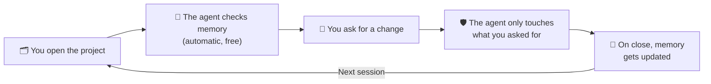

# AgentMemory Kit

**Persistent, structured memory and self-checking behavior for AI coding agents — works across Claude Code, OpenAI Codex CLI, Antigravity (Gemini), and any AGENTS.md-compatible tool.**

🇧🇷 [Leia em Português](docs/README.pt-BR.md)

---

## How it works, in plain terms

New to AI coding agents? Here's the short version: AI models like Claude or Gemini don't remember anything once you close the chat. Ask an agent to build a feature today, come back tomorrow, and it has no idea what happened — not what you decided, not what's finished, not what's still broken.

AgentMemory Kit fixes that. It gives your project a memory folder the agent reads every time it opens, plus a set of guardrails so it never surprises you by changing something you didn't ask about.

The rest of this README goes deeper into how each piece works — read on if you want the details, or jump straight to [Quick start](#quick-start) if you just want to try it.

## Why this exists

AI coding agents forget everything between sessions. AgentMemory Kit gives any project a persistent, versioned, human-readable memory — plus a global orchestrator (hooks + subagent) that automatically checks session health, session length, and task scope, so the agent never starts a session blind and never silently overreaches.

## What's included

- **A numbered memory structure** (`memory/00_PROJECT_OVERVIEW.md` → `memory/16_ENVIRONMENTS.md` + `17_GRAPHIFY_INDEX.md`) — one file per concern, so any agent (or human) knows exactly where to look.
- **`AGENTS.md`** — a universal bootstrap file read natively by Claude Code, Cursor, Codex, Antigravity, Windsurf, Zed, and more.
- **Six mandatory behavior rules**, enforced via `memory/12_AI_CONTEXT_RULES.md`:
  1. **Source of Truth Hierarchy** — code defines what exists, the knowledge graph (when current) defines how it connects, memory defines why.
  2. **Graphify Usage Rule** — prefer a code knowledge-graph query over blind grep/read.
  3. **Major Task Criteria & Self-Check** — before touching the database, auth, more than 3 files, an API contract, the architecture, shared components, or deployment, the agent stops and asks for a planning step.
  4. **Session Length Self-Check** — after 2+ hours in one session, the agent warns you and offers a lightweight checkpoint (not a full close) before continuing.
  5. **Memory Hygiene** — size limits, log rotation, mandatory metadata headers.
  6. **Scope Discipline (Domain Isolation)** — the agent classifies every request by domain (design/UI, backend, database, infrastructure, content) and never touches a domain you didn't ask about without stopping to ask first.
- **A global orchestrator**, installable once per machine:
  - **Claude Code**: a custom subagent (`~/.claude/agents/memory-orchestrator.md`) + two lightweight, zero-token shell hooks (`SessionStart`, `UserPromptSubmit`) that check project memory health and session length automatically.
  - **OpenAI Codex CLI**: the equivalent custom agent in Codex's official TOML format (`~/.codex/agents/memory-orchestrator.toml`) + the same two lifecycle hooks, registered via `~/.codex/config.toml`.
  - **Antigravity**: the equivalent custom agent + lifecycle hooks, using Antigravity's own configuration format.
- **A full prompt catalog** for every stage of a project's life: bootstrapping from nothing, migrating an old single-file memory dump, auditing an existing setup, running a major task safely, closing a session, and periodic maintenance.
- **Optional [Graphify](https://github.com/) integration** — a code knowledge graph the agent queries before falling back to grep, keeping token usage down on large codebases.

## Quick start

### 1. Bootstrap a project's memory

Pick the path that matches your project:

| Situation | Prompt |
|---|---|
| Brand new project, no memory yet | [`prompts/caminho-a-new-project.md`](prompts/caminho-a-new-project.md) |
| Existing memory, incomplete | [`prompts/caminho-b-existing-memory.md`](prompts/caminho-b-existing-memory.md) |
| Old single-file memory dump | [`prompts/caminho-c-migrate-old-memory.md`](prompts/caminho-c-migrate-old-memory.md) |

### 2. Install the global orchestrator (once per machine)

- Claude Code: [`claude-code/INSTALL.md`](claude-code/INSTALL.md)
- Codex CLI: [`codex/INSTALL.md`](codex/INSTALL.md)
- Antigravity: [`antigravity/INSTALL.md`](antigravity/INSTALL.md)

### 3. Daily routine

| When | Prompt |
|---|---|
| Opening a session | [`prompts/daily/prompt-7-open-session.md`](prompts/daily/prompt-7-open-session.md) |
| Before a major/risky task | [`prompts/daily/prompt-8-plan-major-task.md`](prompts/daily/prompt-8-plan-major-task.md) |
| Mid-session checkpoint | [`prompts/daily/prompt-9-lite-checkpoint.md`](prompts/daily/prompt-9-lite-checkpoint.md) |
| Closing a session | [`prompts/daily/prompt-9-close-session.md`](prompts/daily/prompt-9-close-session.md) |
| After a structural code change | [`prompts/daily/prompt-15-refresh-graph.md`](prompts/daily/prompt-15-refresh-graph.md) |
| Full memory audit | [`prompts/audit/full-audit.md`](prompts/audit/full-audit.md) |

Full technical manual: [`docs/MANUAL.md`](docs/MANUAL.md)

## Design principles

- **The agent never installs, deletes, or overwrites without being asked.** Detection and reporting come first; action requires your confirmation.
- **Zero-token automation where possible.** Session-health and session-length checks run as plain shell scripts — no LLM reasoning, no cost, every single time.
- **Portable by design.** Everything lives in the project's own repository (`memory/`, `AGENTS.md`) except the one-time global orchestrator install, which lives per-machine, not per-account.
- **Tool-agnostic.** The same memory files are read correctly by Claude Code, OpenAI Codex CLI, and Antigravity — and by any other tool that reads `AGENTS.md`.

## License

Apache License 2.0 — see [`LICENSE`](LICENSE). Use it, fork it, ship it commercially, just keep the attribution.

## Contributing

Issues and pull requests welcome — see [`CONTRIBUTING.md`](CONTRIBUTING.md).
